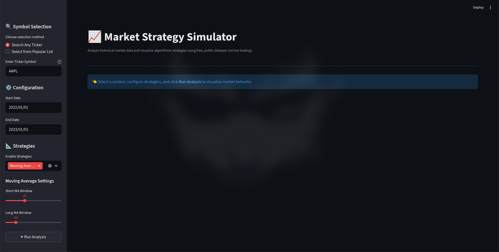
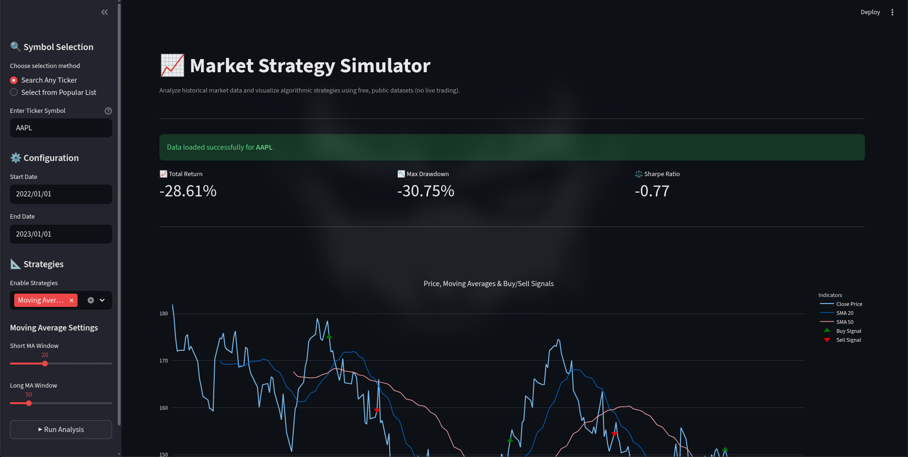
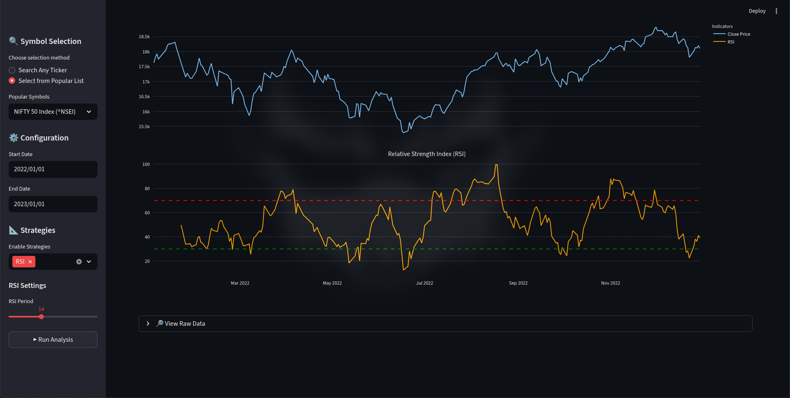
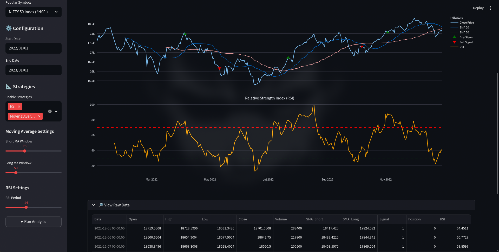

# 📈 Market Strategy Simulator

[](https://market-strategy-simulator.streamlit.app/)

The **Market Strategy Simulator** is an interactive web-based dashboard that allows users to explore historical market data and visualize common algorithmic trading strategies.

## ⚠️ Disclaimer

This project focuses on **analysis and visualization**, not live trading or financial advice.  
It is designed as an educational tool to understand how technical indicators behave across different markets.

---

## 🚀 Features

-   📊 Interactive visualization of historical market data
-   📈 Moving Average (MA) crossover strategy
-   📉 Relative Strength Index (RSI) indicator
-   🟢 Buy/Sell signal markers (visual only)
-   📐 Performance metrics:
    -   Total Return
    -   Maximum Drawdown
    -   Sharpe Ratio
-   🌍 Supports **any Yahoo Finance–compatible ticker**
-   ⭐ Optional curated list of popular US & Indian stocks/indices
-   ⚡ Fast and responsive UI with caching
-   🧠 Currently includes two widely used technical strategies: **Moving Average (MA)** and **Relative Strength Index (RSI)**, with the architecture designed for easy future expansion

---

## 🧠 Project Design

The application is built with a **modular architecture**:

-   `app.py` → UI and orchestration (Streamlit)
-   utils/ → Data loading, indicators, metrics
-   strategies/ → Strategy logic (MA, RSI)
-   data/ → Symbol lists and documentation

### Why this design?

-   Keeps UI, logic, and data concerns separate
-   Makes the system easy to extend with new strategies
-   Improves readability and maintainability
-   Reflects real-world software engineering practices

---

## 📊 Data Sources

-   Historical market data is fetched dynamically from **Yahoo Finance**
-   Data access is handled via the `yfinance` Python library
-   No API keys or paid services are required
-   Market data is not stored in the repository

---

## ⚠️ Disclaimer

This project is intended **for educational purposes only**.

-   It does **not** execute real trades
-   It does **not** provide financial advice
-   All signals and metrics are visual aids to help understand market behavior

---

## 🧪 How to Run the Project

### 1️⃣ Create and activate a virtual environment

#### Create the virtual environment

```bash
python -m venv venv
```

#### Activate the virtual environment

**On Linux / macOS:**

```bash
source venv/bin/activate
```

**On Windows (PowerShell):**

```powershell
venv\Scripts\Activate.ps1
```

**On Windows (Command Prompt):**

```cmd
venv\Scripts\activate
```

### 2️⃣ Install dependencies

```bash
pip install -r requirements.txt
```

### 3️⃣ Run the application

```bash
streamlit run app.py
```

The dashboard will open in your browser at:

```
http://localhost:8501
```

---

## 🌐 Live Demo

The application is also publicly deployed and can be accessed here with the default pre-made Strategies

👉 **[Check the Live Demo](https://market-strategy-simulator.streamlit.app/)**

---

## 🛠 Technologies Used

-   **Python**
-   **Streamlit** – interactive web UI
-   **Pandas / NumPy** – data processing
-   **Plotly** – interactive charts
-   **yfinance** – free market data
-   **Git & GitHub** – version control

---

## 🤖 AI Usage Disclosure

Parts of this project’s documentation and code comments were written with the assistance of AI tools.
All code was reviewed, tested, and modified by the author.

While care has been taken to ensure correctness and clarity, some comments or documentation may contain minor inaccuracies.
The overall design, implementation decisions, testing, and final integration were performed manually.

---

## 🖼 Application Screenshots

Below are screenshots of the **working Market Strategy Simulator dashboard**, demonstrating real-time interaction, strategy visualization, and performance metrics.

### 📊 Dashboard Overview



### 📈 Moving Average Strategy Visualization



### 📉 RSI Indicator Visualization



### 🧮 Combined Strategy & Metrics View


